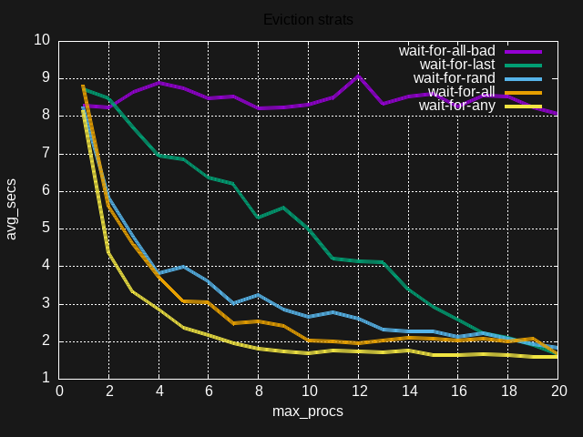
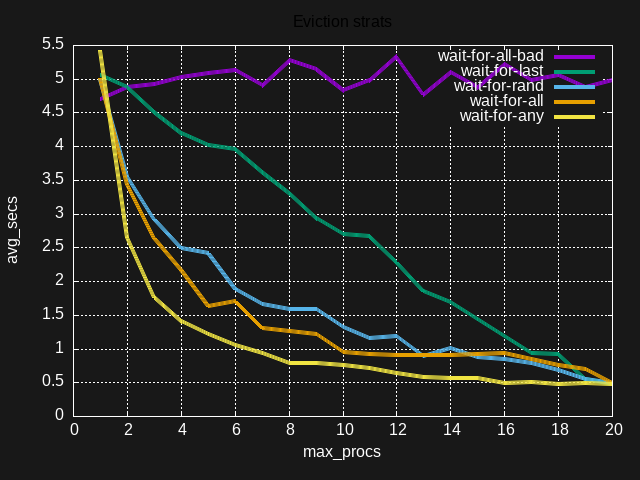

# Results on Tsoding's machine

My setup:

```console
$ neofetch
⠀⠀⠀⠀⠀⠀⠀⠀⠀⠀⠀⠀⠀⣀⣀⣀⣀⠤⣤⣀⣀⠀⠀⠀⠀⠀⠀⠀⠀⠀⠀⠀   streamer@markov
⠀⠀⠀⠀⠀⠀⠀⠀⠀⠀⠀⣤⣶⠿⠉⠉⠉⠀⠉⠉⠿⣶⠀⠀⠀⠀⠀⠀⠀⠀⠀⠀   ---------------
⠀⠀⠀⠀⠀⠀⠀⠀⠀⣀⣿⠛⠀⠀⠀⠀⠀⠀⠀⠀⠀⠿⣀⠀⠀⠀⠀⠀⠀⠀⠀⠀   OS: Penux 6.9 (Your Mom's Linux)
⠀⠀⠀⠀⠀⠀⠀⠀⠀⣿⠉⠀⠀⠀⠀⠶⣶⣶⠀⠀⠀⠀⣿⠀⠀⠀⠀⠀⠀⠀⠀⠀   Host: 21JSS0Y500 ThinkPad E14 Gen 5
⠀⠀⠀⠀⠀⠀⠀⠀⣿⠛⠀⠀⠀⠀⠀⠀⠀⣀⣀⣀⣤⣤⣿⣿⣤⣀⠀⠀⠀⠀⠀⠀   Kernel: 6.12.25_1
⠀⠀⠀⠀⠀⠀⠀⣀⣿⠀⠀⠀⠀⠀⠀⠀⠀⠿⣿⣉⣉⠀⠀⠀⠀⠉⣶⠀⠀⠀⠀⠀   Uptime: 18 days, 23 hours, 56 mins
⠀⠀⠀⠀⠀⠀⠀⣿⠀⠀⠀⠀⠀⠀⠀⠀⠀⠀⠀⠀⠛⣿⣿⣤⣤⣤⠛⠀⠀⠀⠀⠀   Packages: 1365 (xbps-query)
⠀⠀⠀⠀⠀⠀⠀⣿⠀⠀⠀⠀⠀⣀⣶⠶⠶⠿⠉⠉⠿⠿⣶⠀⠀⠀⠀⠀⠀⠀⠀⠀   Shell: bash 5.2.32
⠀⠀⠀⠀⠀⠀⠀⣿⠀⠀⠀⠀⣤⣿⠉⠀⠀⠀⠀⠀⠀⠀⠛⣿⠀⠀⠀⠀⠀⠀⠀⠀   Resolution: 1920x1200, 1920x1080
⠀⠀⠀⠀⠀⠀⠀⣿⠀⠀⠀⠀⣿⠀⠀⠀⠀⠀⠀⠀⠀⠀⠀⠉⣿⠀⠀⠀⠀⠀⠀⠀   Theme: gnome [GTK2]
⠀⠀⠀⠀⠀⠀⠀⣿⣶⠀⠀⠀⣿⠀⠀⠀⠀⠀⠀⠀⠀⠀⠀⣤⠛⣤⣤⠀⠀⠀⠀⠀   Icons: Adwaita [GTK2]
⠀⠀⠀⠀⣶⣿⠛⠛⠀⠛⠶⠶⣿⠶⠶⠶⠶⠶⠶⠶⠶⣛⣛⠛⠀⠀⠛⠿⣶⠀⠀⠀   Terminal: tmux
⠀⠀⠀⠀⠉⠛⠒⣶⣤⣤⣶⠒⠛⠀⠀⠀⠀⠀⠀⠀⠀⠉⠛⠒⣶⣤⣤⣶⠛⠀⠀⠀   CPU: AMD Ryzen 7 7730U with Radeon Graphics (16) @ 4.546GHz
                                   GPU: AMD ATI 04:00.0 Barcelo
                                   Memory: 2675MiB / 14807MiB
```

`wait-for-all-bad` is the results of the bugged implementation of `wait-for-all` strat. Use [./plot.plt](./plot.plt) to create cool graphs with [gnuplot](http://gnuplot.info/) like the ones below.

Loopers:



Sleepers:


